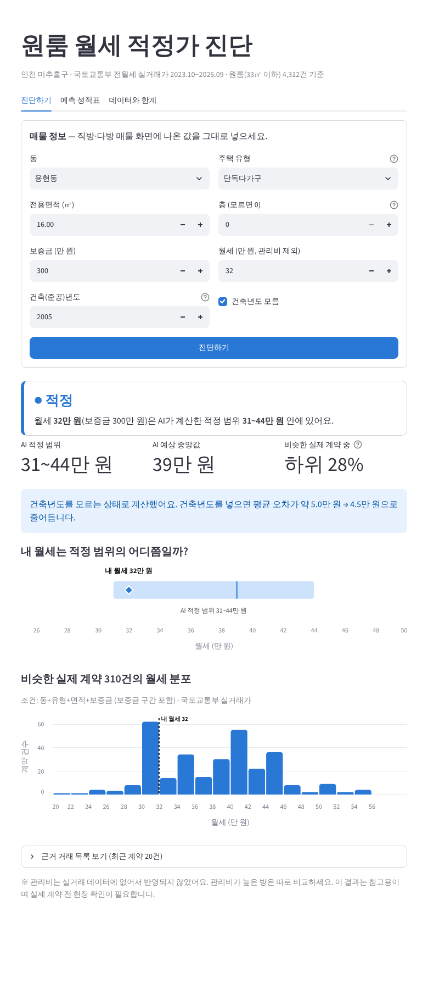

# fair-rent-check — 원룸 월세 적정가 진단

인천 미추홀구 원룸의 **동·유형·면적·보증금·건축년도**를 넣으면, 국토교통부 전월세 실거래가로 학습한 AI가
**적정 월세 범위**와 **비슷한 실제 계약 중 위치**를 보여주고 저렴 / 적정 / 비쌈을 판정합니다.

> AI캡스톤디자인 팀 프로젝트 (2026년 2학기)



## 무엇이 다른가

| 서비스 | 하는 일 | 한계 |
|---|---|---|
| 안심전세앱 (HUG) | 매매시세, 전세 위험진단 | 월세 적정가는 다루지 않음 |
| 직방 AI중개사 | 대화로 "비싼가"에 답함 | 근거 거래·건수·정확도를 보여주지 않음 |
| **fair-rent-check** | 월세 적정 범위 + 근거 거래 + 정확도 공개 | 관리비·옵션 정보 없음 |

## 데이터

- 국토교통부 단독/다가구·연립다세대·오피스텔 전월세 실거래가 (공공데이터포털 Open API)
- 인천 미추홀구, 2023.10 ~ 2026.09, 원룸(8~33㎡) 신규 월세 계약 **4,312건**
- 정제: 원본 20,242건 → 전세·갱신 계약 제외 → 원룸만 → 이상값 제외

## 모델 성적표

과거(2023.10~2026.02)로 학습하고 이후(2026.03~08, 741건)로 시험했습니다. 무작위로 섞지 않았습니다.

| 방법 | 평균 오차 | ±5만 원 이내 |
|---|---|---|
| 전체 중앙값 하나 | 11.32만 원 | 29.8% |
| 비슷한 조건 거래의 중앙값 (기준선) | 5.91만 원 | 64.1% |
| **LightGBM 분위수 회귀** | **4.49만 원** | 66.1% |

- 적정 범위는 실제 계약의 약 절반이 들어오도록 검증 데이터로 보정했습니다 (시험 적중 52.9%).
- 건축년도를 모르면 건축년도 없이 학습한 모델을 씁니다 (평균 오차 4.97만 원).

## 실행 방법

```bash
cd app
pip install -r requirements.txt
streamlit run app.py
```

첫 실행 때 데이터 정리와 학습에 10초 정도 걸립니다.

## 폴더 구성

```
app/          Streamlit 화면(app.py), 핵심 로직(rent_core.py), 데이터
notebooks/    Google Colab 실험 코드 01~04 ("# %%" 단위로 셀 하나씩)
docs/         프로젝트 소개, 화면 캡처
CLAUDE.md     팀원이 Claude와 작업할 때 쓰는 프로젝트 안내서
```

## 한계

- 관리비·옵션·역까지 거리는 실거래 데이터에 없어 반영되지 않습니다.
- 단독다가구는 데이터에 층과 지번이 없습니다.
- 보증금 6천만 원 이하이면서 월세 30만 원 이하인 계약은 신고 의무가 없어 일부만 들어 있습니다.
- 결과는 참고용이며, 실제 계약 전 현장 확인이 필요합니다.

## 출처

국토교통부 전월세 실거래가 자료 (공공데이터포털의 이용 조건을 따릅니다)
