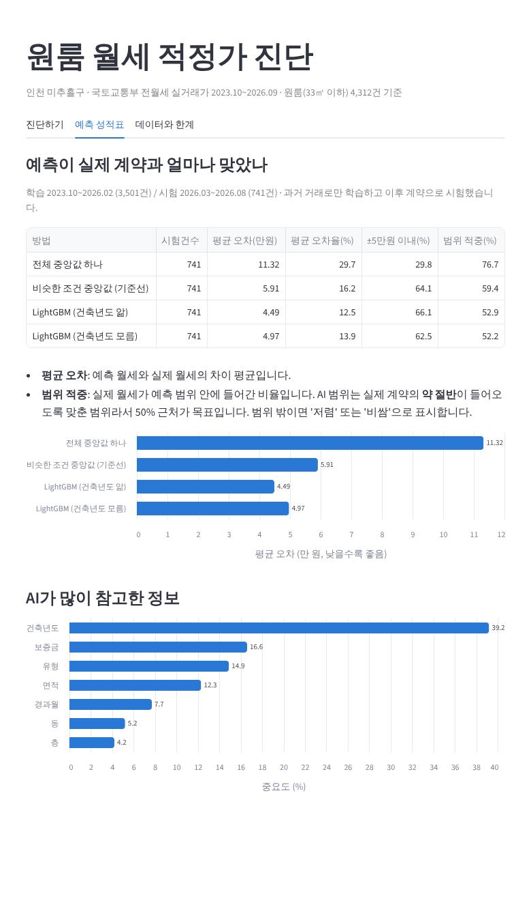

# 원룸 월세 적정가 진단 — 진행 상황 공유 (2026-10-06)

> 이 폴더 하나에 지금까지 한 것이 모두 들어 있습니다. 먼저 이 문서를 읽고, 화면은 `docs/화면_진단하기.png`를 보세요.

## 1. 한 줄 요약

인천 미추홀구 원룸의 조건을 넣으면 **"이 월세가 비슷한 방들의 실제 계약과 비교해 비싼지"**를 알려주는 화면까지 만들었습니다.
AI 모델은 가장 단순한 방법보다 오차를 절반 이하로, 기준선보다 24% 줄였습니다.

## 2. 지금까지 한 일

| 날짜 | 한 일 |
|---|---|
| 10/4 | 주제 후보 검토 (농산물 가격 예측 등) → 투표로 **원룸 월세 적정가 진단** 확정 |
| 10/6 | 경쟁 서비스 직접 확인: 직방 매물·AI중개사, 안심전세앱 |
| 10/6 | 공공데이터 API 3종 신청, 기술문서 확인, 1년치 → 3년치 수집 |
| 10/6 | 정제 → 기준선 → LightGBM → 범위 보정 → Streamlit 화면 |

## 3. 경쟁 서비스와 우리 차별점

| 서비스 | 하는 일 | 우리와 겹치나 |
|---|---|---|
| 안심전세앱 | 매매시세 조회, 전세 위험진단 | 안 겹침 (월세 입력 칸 없음) |
| 직방 매물 화면 | 호가·관리비·면적·층·준공일 표시 | 안 겹침 (시세 대비 판단 없음) |
| 직방 AI중개사 | "이 방 비싸?"에 대화로 답함 | **일부 겹침**. 근거 거래·건수 없음, "실제와 다를 수 있다" 안내 |

**우리 차별점: 실제 계약 근거 + 숫자로 된 범위 + 정확도 공개.**
같은 매물(용현동 16㎡, 300/32)에 대해 직방은 "비싸지 않다"고만 했고, 우리는 "비슷한 실제 계약 310건 중 하위 28%, AI 적정 범위 31~44만 원"을 보여줍니다.

## 4. 데이터

- 출처: 국토교통부 단독/다가구·연립다세대·오피스텔 전월세 실거래가 (공공데이터포털)
- 범위: 인천 미추홀구, 2023년 10월 ~ 2026년 9월
- 정제: 원본 20,242건 → 전세 제외 → 갱신 계약 제외 → 원룸(8~33㎡) → 이상값 제외 → **4,312건**

꼭 알아둘 것:
- 단독다가구에는 **층과 지번이 없습니다.** 면적 칸 이름은 "연면적"이지만 실제로는 방 면적입니다.
- **관리비는 데이터에 없습니다.** 화면에 "관리비 별도"를 꼭 표시합니다.
- 최근 1~2개월은 신고가 덜 들어와 있습니다.

## 5. 모델 성적표

과거(2023.10~2026.02, 3,501건)로 학습하고, 이후(2026.03~08, 741건)로 시험했습니다.

| 방법 | 평균 오차 | ±5만 원 이내 |
|---|---|---|
| 전체 중앙값 하나로 찍기 | 11.32만 원 | 30% |
| 비슷한 조건 거래의 중앙값 (기준선) | 5.91만 원 | 64% |
| **LightGBM (건축년도 앎)** | **4.49만 원** | 66% |
| LightGBM (건축년도 모름) | 4.97만 원 | 63% |

- 예측에 가장 많이 쓰인 정보: **건축년도** > 보증금 > 유형 > 면적
- 건축년도는 직방 매물 정보의 "준공" 날짜를 보고 넣으면 됩니다.
- AI 적정 범위는 실제 계약의 약 절반이 들어오도록 맞췄습니다 (시험 적중 52.9%).

## 6. 팀이 정한 것

- 저렴/적정/비쌈 신호는 **AI 범위 하나로만** 정하고, "실제 계약 중 하위 N%"는 참고로 보여준다.
- 근거 거래가 **20건 미만**이면 "근거 부족" 경고를 띄운다.
- "보증금을 바꾸면 월세 얼마?" 기능은 **7주차**에 전월세 전환율 공식으로 만든다.
  (AI 모델로 계산하면 보증금을 올릴수록 월세도 오른다고 엉뚱하게 나오기 때문)

## 7. 파일 안내

| 위치 | 내용 |
|---|---|
| `CLAUDE.md` | Claude에게 줄 프로젝트 안내서 (아래 8번 참고) |
| `docs/원룸_월세_적정가_진단_프로젝트.md` | 노션용 프로젝트 소개 (경쟁 비교, 약점, 일정) |
| `notebooks/01~04` | Colab 실험 코드. `# %%` 구분선마다 셀 하나씩 붙여넣어 실행 |
| `app/` | Streamlit 화면 (`app.py`), 핵심 로직 (`rent_core.py`), 데이터 |

**화면 실행 방법 (내 컴퓨터에서)**
1. Python 3.10 이상 설치
2. 터미널에서 `app` 폴더로 이동
3. `pip install -r requirements.txt`
4. `streamlit run app.py` → 브라우저가 자동으로 열림 (첫 실행은 학습 때문에 10초 정도 걸림)

**실험 코드 실행 방법 (Colab)**
- `notebooks/02`의 셀 2에 각자 공공데이터포털 인증키(Decoding)를 넣습니다.
- 재수집이 필요 없으면 `app/data/raw_3년.csv`를 구글 드라이브의 `원룸월세` 폴더에 올리고 셀 5부터 실행하면 됩니다.

## 8. Claude 같이 쓰는 법

`CLAUDE.md`에 지금까지의 결정, 데이터 특징, 하지 말 것, 작업 방식(한 단계씩, Colab 코드, 교수님 예상 질문 등)이 정리되어 있습니다.
- **Claude Code를 쓰는 경우:** 이 폴더를 열고 작업하면 `CLAUDE.md`를 자동으로 읽습니다.
- **claude.ai 프로젝트를 쓰는 경우:** 프로젝트 지식(파일)에 `CLAUDE.md`를 올려두세요.
- **일반 대화인 경우:** 대화 시작할 때 `CLAUDE.md` 내용을 붙여넣으세요.
- 결정을 바꾸면 `CLAUDE.md`도 같이 고쳐야 다른 팀원의 Claude가 옛 정보로 답하지 않습니다.

## 9. 다음 할 일 (역할은 정해지면 이름 채우기)

| 할 일 | 담당 | 시기 |
|---|---|---|
| 각자 화면 실행해 보고 피드백 남기기 | 전원 | 이번 주 |
| 학생 5~10명 설문 + 화면 사용 테스트 | | 2~3주차 |
| 다방·네이버부동산 원룸 시세 기능 확인 | | 이번 주 |
| "보증금 바꾸면?" 기능 (전환율 공식, 현재 수치 확인 필요) | | 7주차 |
| Claude API로 "왜 비싼지" 설명 문장 붙이기 | | 7~8주차 |
| 배포 (Streamlit Community Cloud 검토) | | 8주차 |
| 보고서·발표 자료 | | 9~10주차 |

**아직 안 정한 것:** 역할 분담, 주변 구(연수구·남동구) 추가 여부, 발표일 확정.

## 10. 발표에서 나올 만한 질문

- **"직방 보면 되지 않나요?"** → 직방 AI중개사는 근거 거래 수를 말하지 않고 "실제와 다를 수 있다"고 안내합니다. 우리는 실제 계약 몇 건 중 어디쯤인지와 예측 정확도를 공개합니다.
- **"이게 AI인가요?"** → 비슷한 조건 거래의 중앙값(기준선)을 먼저 재고, LightGBM이 그보다 오차를 24% 줄였음을 같은 시험 데이터로 보여줍니다.
- **"왜 데이터를 무작위로 나누지 않았나요?"** → 실제 서비스는 과거 거래로 앞으로의 계약을 판단하기 때문입니다. 무작위로 섞으면 미래 정보가 학습에 들어가 성능이 부풀려집니다.
